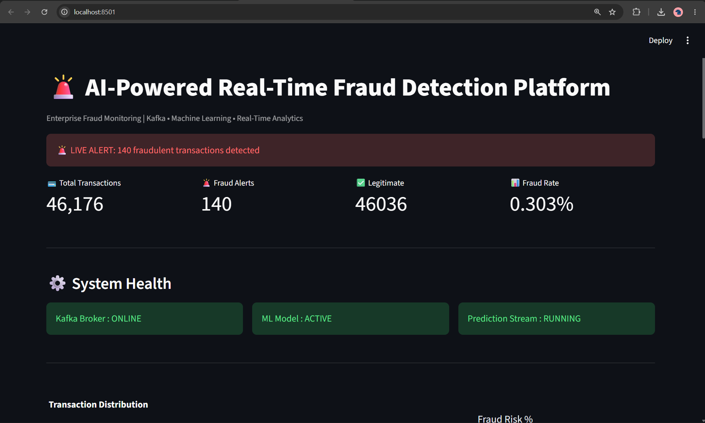
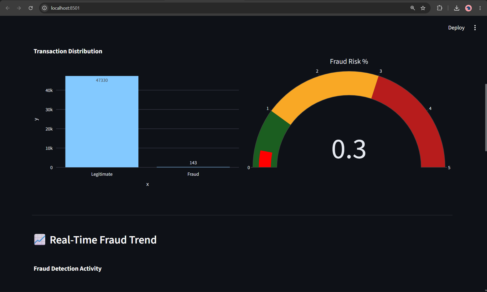
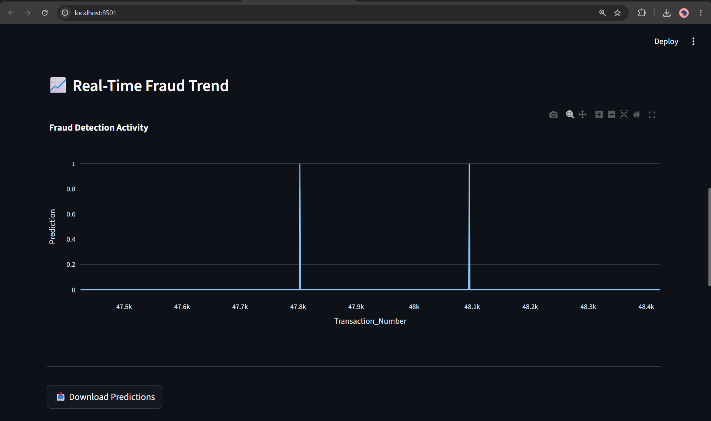

````markdown
# 🚨 AI-Powered Real-Time Fraud Detection Platform

A production-style real-time fraud detection system built using **Apache Kafka**, **Machine Learning**, and **Streamlit**. The platform continuously processes transaction streams, applies fraud prediction using a trained Random Forest model, and visualizes fraud activity through an interactive monitoring dashboard.

---

## 📌 Overview

Financial institutions process millions of transactions every day, making real-time fraud detection critical for preventing financial losses and protecting customers.

This project simulates a real-world fraud detection pipeline where transaction data is streamed through Kafka, analyzed using a machine learning model, and displayed on a live monitoring dashboard.

The system automatically identifies suspicious transactions, generates fraud alerts, maintains prediction logs, and provides operational visibility through a premium analytics dashboard.

---

# ✨ Features

- 🚀 Real-Time Transaction Streaming using Apache Kafka
- 🤖 Machine Learning-Based Fraud Detection
- 📊 Live Monitoring Dashboard
- 🔄 Auto Refresh Every 5 Seconds
- 🚨 Instant Fraud Alerts
- 📈 Fraud Trend Analytics
- 📉 Fraud Rate Monitoring
- 🎯 Fraud Risk Gauge
- 📥 Download Predictions as CSV
- ⚙️ System Health Monitoring
- 📋 Recent Fraud Alert Tracking
- 🏗️ Scalable Event-Driven Architecture

---

# 🏗️ System Architecture

```text
Credit Card Transactions
            │
            ▼
     Kafka Producer
            │
            ▼
      Kafka Topic
(creditcard_transactions)
            │
            ▼
    ML Prediction Engine
 (Random Forest Model)
            │
            ▼
     Prediction Store
    (predictions.csv)
            │
            ▼
     Streamlit Dashboard
            │
            ▼
     Fraud Monitoring UI
````

---

# ⚙️ Tech Stack

## Programming Language

* Python 3.11

## Streaming Platform

* Apache Kafka

## Machine Learning

* Scikit-Learn
* Random Forest Classifier

## Data Processing

* Pandas
* NumPy

## Dashboard & Visualization

* Streamlit
* Plotly

## Model Storage

* Joblib

---

# 📂 Project Structure

```text
FraudDetectionProject/

├── .streamlit/
│   └── config.toml
│
├── dashboard/
│   └── app.py
│
├── consumer/
│   └── transaction_consumer.py
│
├── producer/
│   └── dataset_producer.py
│
├── model/
│   ├── train_model.py
│   └── fraud_model.pkl
│
├── data/
│   ├── creditcard.csv
│   └── predictions.csv
│
├── spark_jobs/
│   └── ml_fraud_detection.py
│
└── requirements.txt
```

---

# 🤖 Machine Learning Model

## Model Used

**Random Forest Classifier**

### Why Random Forest?

* Handles highly imbalanced fraud datasets
* Resistant to overfitting
* Excellent classification performance
* Works well with high-dimensional transaction data
* Reliable for production-style fraud detection systems

### Model Performance

| Metric    | Score |
| --------- | ----- |
| Precision | 94%   |
| Recall    | 82%   |
| F1 Score  | 87%   |

---

# 🔍 How Fraud Detection Works

### Step 1: Transaction Generation

Transaction data is streamed continuously through Kafka.

### Step 2: Kafka Streaming

Producer publishes transaction events into:

```text
creditcard_transactions
```

topic.

### Step 3: Real-Time Consumption

Consumer listens for incoming transaction events.

### Step 4: Feature Processing

Transaction features are converted into model-compatible format.

### Step 5: Fraud Prediction

Random Forest model predicts:

```text
0 → Legitimate Transaction
1 → Fraudulent Transaction
```

### Step 6: Prediction Storage

Predictions are stored in:

```text
predictions.csv
```

### Step 7: Live Dashboard Updates

Dashboard automatically refreshes and displays:

* Fraud Alerts
* Fraud Rate
* Transaction Metrics
* Fraud Trends

---

# 📊 Dashboard Features

## Executive Metrics

* Total Transactions
* Fraud Alerts
* Legitimate Transactions
* Fraud Rate %

## Live Monitoring

* Auto Refresh Every 5 Seconds
* Real-Time Fraud Monitoring
* Dynamic Dashboard Updates

## Visual Analytics

* Fraud Risk Gauge
* Transaction Distribution
* Fraud Trend Analytics
* Recent Fraud Alert Table

## Operational Monitoring

* Kafka Broker Status
* ML Model Status
* Prediction Stream Status

## Reporting

* Export Predictions CSV
* Historical Fraud Analysis

---

# 📸 Screenshots

## Main Dashboard

> Add Screenshot Here



---

## Fraud Risk Analytics

> Add Screenshot Here



---

## Fraud Trend Monitoring

> Add Screenshot Here



---

## Recent Fraud Alerts

> Add Screenshot Here


---

# 🚀 Application Workflow

```text
Start Kafka Broker
        │
        ▼
Run Transaction Producer
        │
        ▼
Publish Transactions
        │
        ▼
Consume Transactions
        │
        ▼
Run Fraud Prediction Model
        │
        ▼
Store Predictions
        │
        ▼
Update Dashboard
        │
        ▼
Display Fraud Alerts
```

---

# 💡 Implementation Highlights

### Event-Driven Architecture

Kafka handles transaction events independently from prediction services.

### Real-Time Fraud Prediction

Transactions are analyzed immediately after ingestion.

### Automated Monitoring

Dashboard updates automatically without manual refresh.

### Enterprise Dashboard Experience

Includes:

* KPI Monitoring
* Fraud Risk Analytics
* Alert Management
* Trend Analysis
* CSV Export Functionality

### Scalable Design

Producer, Consumer, ML Model, and Dashboard are completely decoupled.

---

# 🔮 Future Enhancements

* PostgreSQL Integration
* Spark Structured Streaming
* Docker Containerization
* MLflow Model Tracking
* Grafana Monitoring
* Cloud Deployment (AWS/Azure)
* REST APIs
* Multi-Model Fraud Detection
* Real-Time Notifications
* User Authentication & RBAC

---

# 👨‍💻 Author

**Atharva Shinde**

Computer Engineering Student | Machine Learning & Data Engineering Enthusiast

---

## ⭐ If you found this project useful, please consider giving it a star.

```
```
